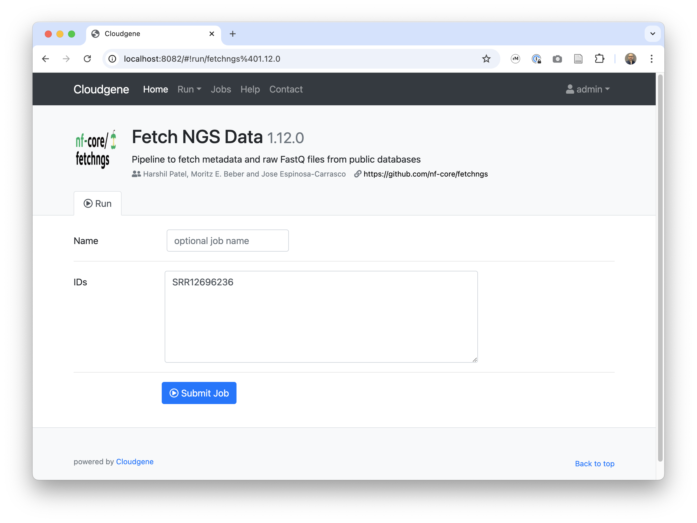
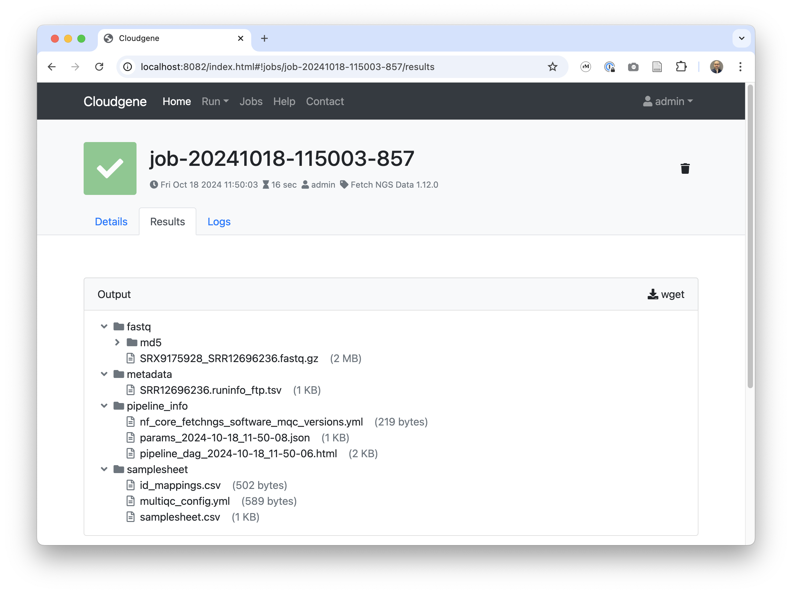

---
hide:
  - navigation
  - toc 
---
<div class="header" markdown="1">

# Cloudgene 3

## Turn Your Nextflow Pipeline into a Powerful Web Service

[:fontawesome-solid-book: Getting Started](server/getting-started.md){ .md-button .md-button} [:fontawesome-solid-download: Installation](installation.md){ .md-button } [:fontawesome-brands-github: Source](https://github.com/genepi/cloudgene3){ .md-button }


Documentation of [Cloudgene 2](https://v2.cloudgene.io/)
</div>

---
[:material-check-circle:]() **Build** your analysis pipeline in Nextflow <br/>
[:material-check-circle:]() **Integrate** your analysis pipeline into Cloudgene by writing a simple configuration file <br/>
[:material-check-circle:]() **Get** a powerful web application with user management, data transfer, error handling and more <br/>
[:material-check-circle:]() **Deploy** your application with one click to in-house clusters or public Clouds like Amazon AWS <br/>
[:material-check-circle:]() **Offer** your application as SaaS to other scientists, managing thousands of jobs <br/>
[:material-check-circle:]() **Share** your application, enabling others to clone your service to their own hardware or private cloud instance <br/>
---

## :octicons-package-16: Integrate Your Nextflow pipelines

Integrate your analysis pipeline into Cloudgene by writing a simple configuration file.

=== ":material-file: cloudgene.yaml"

    ```yaml
    id: fetch-ngs
    name: FetchNGS
    description: Pipeline to fetch metadata and raw FastQ files from public databases
    version: 1.12.0
    website: https://github.com/nf-core/fetchngs
    workflow:
      steps:
        - name: Fetch NGS
          script: nf-core/fetchngs
          revision: 1.12.0
    
      inputs:
        - id: input
          description: IDs
          type: textarea
          value: "SRR12696236"
          writeFile: "ids.csv"
    
      outputs:
        - id: outdir
          description: Output
          type: folder
    ```
=== ":material-file: Web-Interface"
    
=== ":material-file: Results"
    
---

## :fontawesome-solid-share: Share your pipeline

Share your application via HTTP, GitHub, or S3, and enable users to install it with a simple command.

```bash
cloudgene install lukfor/cg-fetchngs
```

## :fontawesome-solid-diagram-project: Combine Your Nextflow pipeline with others

Combine your Nextflow pipeline with other pipelines and create use-case specific web services.

=== ":material-file: cloudgene.yaml"

    ```yaml
    id: taxprofiler
    name: Taxprofiler
    description: Taxonomic classification and profiling of shotgun short- and long-read metagenomic data
    version: 1.1.8
    website: https://github.com/nf-core/taxprofiler
    author: James A. Fellows Yates, Sofia Stamouli, Moritz E. Beber, and the nf-core/taxprofiler team
    logo: https://raw.githubusercontent.com/nf-core/fetchngs/master/docs/images/nf-core-fetchngs_logo_light.png

    workflow:
      steps:
        - name: Fetch Data
          script: nf-core/fetchngs
          revision: 1.12.0
          stdout: true
          params:
            input: "${input_ids}"

        - name: Run taxprofiler
          script: nf-core/taxprofiler
          revision: 1.1.8
          stdout: true
          params:
            input: "${outdir}/samplesheet/samplesheet.csv"
            databases: "https://raw.githubusercontent.com/nf-core/test-datasets/taxprofiler/database_full_v1.2.csv"
            multiqc_title: "${CLOUDGENE_JOB_NAME}"

      inputs:
        - id: input_ids
          description: IDs
          type: textarea
          value: "SRR12696236"
          writeFile: "ids.csv"
          serialize: false

      outputs:
        - id: outdir
          description: Output
          type: folder
    ```
=== ":material-file: Web-Interface"
    
=== ":material-file: Results"
    
## Who uses Cloudgene?


### Michigan Imputation Server 2

[Michigan Imputation Server 2](https://imputationserver.sph.umich.edu) provides a free genotype imputation service (chromosomes 1-22, chromosome X and HLA region) using Minimac4. You can upload phased or unphased GWAS genotypes and receive phased and imputed genomes in return. Our server supports imputation from numerous reference panels. For all uploaded datasets a comprehensive QC is performed. The complete source code is available on [GitHub](https://github.com/genepi/imputationserver2).

### mtDNA-Server 2

[mtDNA-Server 2](https://mitoverse.i-med.ac.at) is a Nextflow DSL2 pipeline to accurately detect heteroplasmic and homoplasmic variants in mitochondrial (mtDNA) genomes. The complete source code can be acccessed [here](https://github.com/genepi/mtdna-server-2).

### Haplocheck

[Haplocheck](https://mitoverse.i-med.ac.at) detects in-sample contamination in mtDNA or WGS sequencing studies by analyzing the mitchondrial content. 

## Citation

Schönherr S, Forer L, Weißensteiner H, Kronenberg F, Specht G, Kloss-Brandstätter A. Cloudgene: a graphical execution platform for MapReduce programs on private and public clouds. BMC Bioinformatics. 2012 Aug 13;13:200. doi: 10.1186/1471-2105-13-200. PMID: 22888776; PMCID: PMC3532373.

---

## About

Cloudgene has been created by [Lukas Forer](https://twitter.com/lukfor) and [Sebastian Schönherr](https://twitter.com/seppinho) and is MIT Licensed.


[](https://github.com/lukfor)
[](https://github.com/seppinho)

Thanks to all the [contributors](about.md) to help us maintaining and improving Cloudgene!
